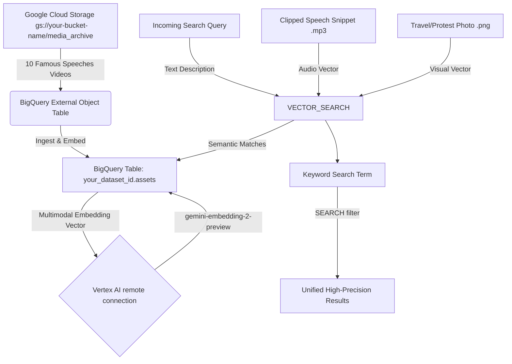

# BigQuery Omniscience Media Archive: Multimodal AI Demo Walkthrough

This walkthrough provides a step-by-step guide to the **BigQuery Omniscience Media Archive** demo. It showcases how to ingest unstructured historical media, autonomously generate multimodal embeddings using Vertex AI, and perform high-precision semantic, cross-modal, and hybrid searches.

---

## 🛠️ Demo Architecture



---

## 📁 Active Media Assets

The demo utilizes the following verified, high-fidelity media assets:

| Asset Type | Subfolder | Description & Metadata Mappings |
| :--- | :--- | :--- |
| **10 Videos** | `/speeches/` | Famous public-domain speech recordings (MLK, JFK, Reagan, FDR, Nixon, Eisenhower, RFK). |
| **3 Audios** | `/queries/` | Clipped audio snippets of the exact featured lines for MLK, Reagan, and JFK. |
| **2 Images** | `/hybrid/` | Recent photos of the **U.S. Capitol**:<br>1. `capitol-dc.png` (Tourism sight-seeing perspective)<br>2. `protest.png` (Protest in front of the Capitol) |

---

## 🚀 Step 1: Ingest and Automate (Setup)

In this step, we register the remote multimodal embedding model, set up a dynamic **external GCS Object Table** to discover speech video files in GCS, define the standard speeches table with **Autonomous Embedding** enabled, and autonomously synchronize them.

### 1. Create the Remote Vertex AI Model
Ensure you have a Cloud Resource connection named `your-project-id.us.your-connection-id` in the `us` region.
```sql
CREATE OR REPLACE MODEL `your_dataset_id.multimodal_model`
REMOTE WITH CONNECTION `your-project-id.us.your-connection-id`
OPTIONS (ENDPOINT = 'gemini-embedding-2-preview');
```

### 2. Create the External GCS Object Table
This table points directly to GCS and autonomously indexes files as they are uploaded or deleted.
```sql
CREATE OR REPLACE EXTERNAL TABLE `your_dataset_id.assets_metadata`
WITH CONNECTION `your-project-id.us.your-connection-id`
OPTIONS (
  object_metadata = 'SIMPLE',
  uris = ['gs://your-bucket-name/media_archive/speeches/*']
);
```

### 3. Create the Speeches Assets Table with Autonomous Embedding Enabled
Using the native `AI.EMBED` generated column, pointing to the `uri` column as the source. The `asynchronous = TRUE` stored option tells BigQuery to generate and update the embeddings in the background.
```sql
CREATE OR REPLACE TABLE `your_dataset_id.assets` (
  asset_id STRING,
  uri STRING,
  asset_embedding STRUCT<result ARRAY<FLOAT64>, status STRING>
    GENERATED ALWAYS AS (
      AI.EMBED(
        uri,
        connection_id => 'your-project-id.us.your-connection-id',
        endpoint => 'gemini-embedding-2-preview'
      )
    ) STORED OPTIONS (asynchronous = TRUE)
);
```

### 4. Autonomously Ingest Assets from GCS Object Table (Synchronization)
We synchronize all speech video files from our external GCS Object Table into our base standard table. The standard table will autonomously trigger multimodal embedding generation in the background for all new files.
```sql
INSERT INTO `your_dataset_id.assets` (asset_id, uri)
SELECT
  REGEXP_EXTRACT(uri, r'([^/]+)\.[^.]+$') AS asset_id, -- Extract file name (e.g. '01_mlk_dream')
  uri
FROM
  `your_dataset_id.assets_metadata`
WHERE
  uri NOT IN (SELECT uri FROM `your_dataset_id.assets`);
```

### 5. Monitor Ingest & Generate flat Searchable table
We check the autonomous embedding progress, and then run a sandbox materialization query to flatten the embeddings for quick `VECTOR_SEARCH` queries (required when rows < 5000):
```sql
-- A. Check progress
SELECT
  COUNT(*) AS total_num_rows,
  COUNTIF(asset_embedding IS NOT NULL AND asset_embedding.status = '') AS total_num_generated_embeddings
FROM `your_dataset_id.assets`;

-- B. Flatten for query
CREATE OR REPLACE TABLE `your_dataset_id.assets_searchable` AS
SELECT
  asset_id,
  uri,
  asset_embedding.result AS embedding
FROM
  `your_dataset_id.assets`;
```

---

## 🔍 Step 2: Cross-Modal Discovery

Cross-modal search demonstrates querying unstructured videos using different input modalities (text and audio).

### Scene A: Text-to-Video Search
Search for a speech video based on a natural language text description:
```sql
WITH text_query AS (
  SELECT ml_generate_embedding_result AS vector
  FROM ML.GENERATE_EMBEDDING(
    MODEL `your_dataset_id.multimodal_model`,
    (SELECT 'historical political speech given at night in a stadium' AS content)
  )
)
SELECT base.asset_id, distance
FROM VECTOR_SEARCH(
  TABLE `your_dataset_id.assets_searchable`,
  'embedding',
  (SELECT vector FROM text_query),
  top_k => 5,
  distance_type => 'COSINE'
);
```

### Scene B: Audio-to-Video Search
Query the speeches database using one of our clipped audio snippets (e.g., Martin Luther King Jr.'s *"I have a dream"* snippet) to find the corresponding full video recording:
```sql
WITH audio_query AS (
  SELECT ml_generate_embedding_result AS vector
  FROM ML.GENERATE_EMBEDDING(
    MODEL `your_dataset_id.multimodal_model`,
    (SELECT 'gs://your-bucket-name/media_archive/queries/1-MLK-Dream_clipped.mp3' AS content)
  )
)
SELECT base.asset_id, distance
FROM VECTOR_SEARCH(
  TABLE `your_dataset_id.assets_searchable`,
  'embedding',
  (SELECT vector FROM audio_query),
  top_k => 5,
  distance_type => 'COSINE'
);
```

---

## 🎯 Step 3: High-Precision Multimodal Hybrid Search

This step demonstrates a powerful multimodal hybrid query combining **visual semantic retrieval** and **full-text keyword filtering** to achieve maximum search precision.

### The Hybrid Search Narrative
* **Visual Query:** A photo of the **U.S. Capitol** (`capitol-dc.png`) is used. The multimodal model maps the U.S. Capitol photo close to speeches delivered at the Capitol (e.g., JFK's Inaugural Address).
* **Textual Query:** The keyword `'inaugural'` matches the speech metadata terms.
* **Result:** The unified query matches the visual location context and the table metadata to perfectly retrieve `08_jfk_inaugural`!

```sql
WITH reference_image_embedding AS (
  SELECT ml_generate_embedding_result AS vector
  FROM ML.GENERATE_EMBEDDING(
    MODEL `your_dataset_id.multimodal_model`,
    (SELECT 'gs://your-bucket-name/media_archive/hybrid/capitol-dc.png' AS content)
  )
)
SELECT base.asset_id, distance
FROM VECTOR_SEARCH(
  TABLE `your_dataset_id.assets_searchable`,
  'embedding',
  (SELECT vector FROM reference_image_embedding),
  top_k => 5,
  distance_type => 'COSINE'
)
WHERE SEARCH(base, 'inaugural'); -- Exact text keyword filter
```

> [!TIP]
> **Protest Scene Comparison (Advanced Showcase):**
> You can demonstrate the visual precision of the model by swapping the tourism image (`capitol-dc.png`) with the protest photo (`protest.png`) and filtering for the keyword `'rfk'` or `'assassination'` to retrieve Robert F. Kennedy's remarks on the MLK assassination (`10_rfk_mlk_assassination`), which was delivered under similar high-tension socio-political contexts!
